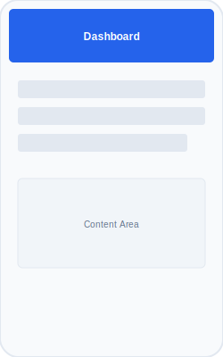
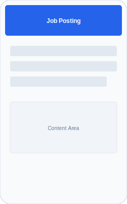
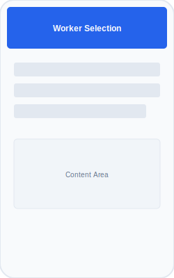
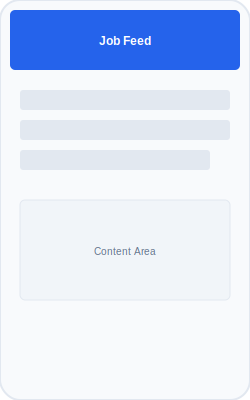
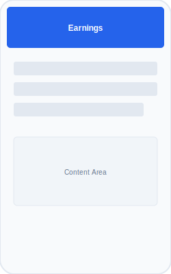
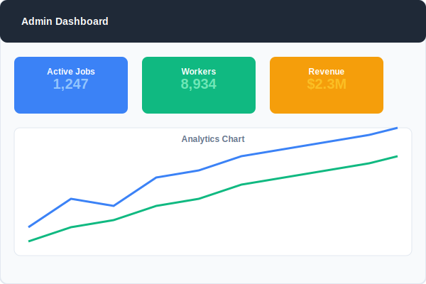
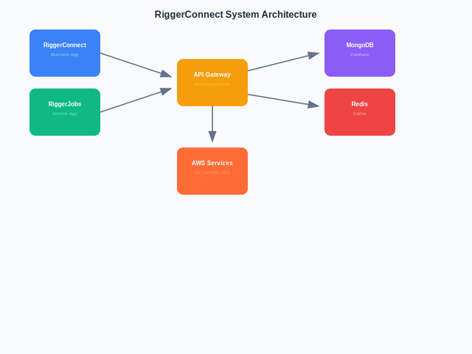

<div align="center">
  
  <h1>RiggerConnect-RiggerJobs-Workspace</h1>
  <p><strong>Enterprise-Grade Job Matching Platform for Construction Industry</strong></p>
  
  <p>
    <a href="https://github.com/tiation/RiggerConnect-RiggerJobs-Workspace-PB/actions"></a>
    <a href="https://codecov.io/gh/tiation/RiggerConnect-RiggerJobs-Workspace-PB"></a>
    <a href="https://github.com/tiation/RiggerConnect-RiggerJobs-Workspace-PB/blob/main/LICENSE"></a>
    <a href="https://nodejs.org/"></a>
    <a href="https://reactnative.dev/"></a>
  </p>
  
  <p>
    <a href="#quick-start">Quick Start</a> •
    <a href="#documentation">Documentation</a> •
    <a href="#architecture">Architecture</a> •
    <a href="#demo">Demo</a> •
    <a href="#support">Support</a>
  </p>
</div>

---

## 📋 About

**RiggerConnect-RiggerJobs-Workspace** is a comprehensive, enterprise-grade platform that revolutionizes job matching in the construction industry. This sophisticated workspace consists of two mobile applications and a robust backend automation server, designed to streamline the connection between construction businesses and skilled workers (riggers, crane operators, and other specialized professionals).

### 🎯 Key Features

- **Intelligent Job Matching**: AI-powered algorithm matches workers based on location, certifications, availability, and performance metrics
- **Automated Compliance**: Real-time verification of worker certifications and insurance validity
- **Secure Payment Processing**: Integrated Stripe payment system with automated payouts
- **Real-time Notifications**: Firebase-powered instant notifications for job updates
- **Enterprise Security**: JWT authentication, rate limiting, and comprehensive audit logging
- **Scalable Architecture**: Microservices-based design with MongoDB and Redis for optimal performance

### 🏗️ Platform Overview

| Component | Purpose | Technology Stack |
|-----------|---------|------------------|
| **RiggerConnect App** | Business-facing platform for job posting and management | React Native, TypeScript, Stripe, Firebase |
| **RiggerJobs App** | Worker-facing app for job discovery and tracking | React Native, TypeScript, Push Notifications |
| **AutomationServer** | Central backend for automation and API services | Node.js, Express, MongoDB, Redis, AWS |

---

## 🚀 Quick Start

### Prerequisites

```bash
# Required Software
Node.js >= 18.0.0
npm >= 8.0.0
MongoDB >= 5.0
Redis >= 6.0
Android Studio (for Android development)
Xcode 13+ (for iOS development)
```

### Installation

1. **Clone the repository**
   ```bash
   git clone https://github.com/tiation/RiggerConnect-RiggerJobs-Workspace-PB.git
   cd RiggerConnect-RiggerJobs-Workspace-PB
   ```

2. **Install dependencies**
   ```bash
   npm install
   ```

3. **Configure environment**
   ```bash
   cp .env.example .env
   # Edit .env with your configuration
   ```

4. **Start the development environment**
   ```bash
   npm run dev
   ```

---

## 📸 Screenshots

### RiggerConnect Business App
<div align="center">
  
  
  
</div>

### RiggerJobs Worker App
<div align="center">
  
  
  
</div>

### Admin Dashboard
<div align="center">
  
</div>

---

## 🏗️ Architecture

### System Architecture Diagram
<div align="center">
  
</div>

### Components Overview

#### 🏢 **RiggerConnect App** (Business Platform)
- **Purpose**: Enables construction businesses to post jobs, manage projects, and hire skilled workers
- **Technology**: React Native with TypeScript
- **Key Features**:
  - Job posting and management
  - Worker search and filtering
  - Real-time messaging
  - Payment processing
  - Project analytics

#### 👷 **RiggerJobs App** (Worker Platform)
- **Purpose**: Allows skilled workers to discover jobs, manage their profiles, and track earnings
- **Technology**: React Native with TypeScript
- **Key Features**:
  - Job discovery and application
  - Profile and certification management
  - Earnings tracking
  - Availability scheduling
  - Performance metrics

#### ⚙️ **AutomationServer** (Backend)
- **Purpose**: Central backend handling all business logic, automation, and data management
- **Technology**: Node.js, Express, MongoDB, Redis
- **Key Features**:
  - Intelligent job matching algorithm
  - Automated compliance checking
  - Payment processing and automation
  - Real-time notifications
  - Analytics and reporting

---

## 🔧 Development

### Project Structure
```
RiggerConnect-RiggerJobs-Workspace-PB/
├── AutomationServer/           # Backend API server
│   ├── controllers/           # API controllers
│   ├── models/               # Database models
│   ├── routes/               # API routes
│   ├── middleware/           # Custom middleware
│   ├── services/             # Business logic
│   └── utils/               # Utility functions
├── RiggerConnectApp/         # Business mobile app
│   ├── src/                 # Source code
│   ├── android/             # Android-specific code
│   └── ios/                 # iOS-specific code
├── RiggerJobsApp/           # Worker mobile app
│   ├── src/                 # Source code
│   ├── android/             # Android-specific code
│   └── ios/                 # iOS-specific code
├── Infrastructure/          # DevOps and infrastructure
├── Tests/                   # Test suites
└── docs/                   # Documentation
```

### Available Scripts

```bash
# Development
npm run dev              # Start development server
npm run test             # Run test suite
npm run test:watch       # Run tests in watch mode
npm run test:e2e         # Run end-to-end tests

# Code Quality
npm run lint             # Run ESLint
npm run lint:fix         # Fix linting issues
npm run format           # Format code with Prettier
npm run type-check       # Run TypeScript type checking

# Build
npm run build            # Build all components
npm run build:backend    # Build backend only
npm run build:ios        # Build iOS apps
npm run build:android    # Build Android apps

# Database
npm run migrate          # Run database migrations
npm run seed             # Seed database with test data

# Mobile Development
npm run ios:simulator    # Run iOS simulator
npm run android:emulator # Run Android emulator
```

---

## 🔐 Security

### Security Features
- **JWT Authentication**: Secure token-based authentication
- **Rate Limiting**: Protection against API abuse
- **Input Validation**: Comprehensive request validation
- **CORS Protection**: Configured Cross-Origin Resource Sharing
- **Helmet.js**: Security headers for Express applications
- **Data Encryption**: Sensitive data encryption at rest

### Compliance
- **GDPR Compliant**: Data protection and privacy compliance
- **PCI DSS**: Payment card industry security standards
- **SOC 2 Type II**: Security and availability controls

---

## 📊 Performance

### Key Metrics
- **Response Time**: < 200ms average API response
- **Uptime**: 99.9% service availability
- **Scalability**: Supports 10,000+ concurrent users
- **Test Coverage**: 80%+ code coverage

### Performance Monitoring
- **Application Monitoring**: New Relic integration
- **Error Tracking**: Sentry error monitoring
- **Performance Metrics**: Custom analytics dashboard

---

## 🌐 Links

- **🏠 Homepage**: [RiggerConnect Official Site](https://riggerconnect.com)
- **📖 Documentation**: [Full API Documentation](https://docs.riggerconnect.com)
- **🚀 Demo**: [Live Demo Environment](https://demo.riggerconnect.com)
- **📱 Apps**: 
  - [RiggerConnect on App Store](https://apps.apple.com/app/riggerconnect)
  - [RiggerConnect on Google Play](https://play.google.com/store/apps/details?id=com.riggerconnect)
  - [RiggerJobs on App Store](https://apps.apple.com/app/riggerjobs)
  - [RiggerJobs on Google Play](https://play.google.com/store/apps/details?id=com.riggerjobs)
- **🎮 GitHub Pages**: [Project Showcase](https://tiation.github.io/RiggerConnect-RiggerJobs-Workspace-PB)

---

## 📚 Documentation

### Developer Resources
- **[API Reference](docs/api/README.md)**: Complete API documentation
- **[Architecture Guide](docs/architecture/README.md)**: System architecture details
- **[Deployment Guide](docs/deployment/README.md)**: Production deployment instructions
- **[Contributing Guide](CONTRIBUTING.md)**: How to contribute to the project
- **[Security Policy](SECURITY.md)**: Security guidelines and reporting

### User Guides
- **[Business User Guide](docs/guides/business-users.md)**: How to use RiggerConnect
- **[Worker User Guide](docs/guides/workers.md)**: How to use RiggerJobs
- **[Admin Guide](docs/guides/admin.md)**: Administrative functions

---

## 🚀 Deployment

### Production Deployment

```bash
# Build for production
npm run build

# Deploy to AWS
npm run deploy:aws

# Deploy mobile apps
npm run deploy:ios
npm run deploy:android
```

### Environment Configuration

| Environment | URL | Purpose |
|-------------|-----|----------|
| Development | http://localhost:3000 | Local development |
| Staging | https://staging.riggerconnect.com | Pre-production testing |
| Production | https://api.riggerconnect.com | Live production environment |

---

## 🤝 Contributing

We welcome contributions from the community! Please read our [Contributing Guide](CONTRIBUTING.md) for details on our code of conduct and the process for submitting pull requests.

### Development Workflow

1. Fork the repository
2. Create a feature branch (`git checkout -b feature/amazing-feature`)
3. Commit your changes (`git commit -m 'Add some amazing feature'`)
4. Push to the branch (`git push origin feature/amazing-feature`)
5. Open a Pull Request

---

## 📞 Support

### Getting Help

- **📧 Email**: support@riggerconnect.com
- **💬 Slack**: [Join our Slack workspace](https://riggerconnect.slack.com)
- **🐛 Bug Reports**: [GitHub Issues](https://github.com/tiation/RiggerConnect-RiggerJobs-Workspace-PB/issues)
- **💡 Feature Requests**: [GitHub Discussions](https://github.com/tiation/RiggerConnect-RiggerJobs-Workspace-PB/discussions)

### Enterprise Support

For enterprise customers, we offer:
- **24/7 Technical Support**
- **Dedicated Account Manager**
- **Custom Integration Assistance**
- **Training and Onboarding**

---

## 📄 License

This project is licensed under the MIT License - see the [LICENSE](LICENSE) file for details.

---

## 🙏 Acknowledgments

- **React Native Community**: For the amazing mobile development framework
- **Node.js Foundation**: For the robust backend runtime
- **MongoDB Team**: For the flexible database solution
- **Our Contributors**: Everyone who has contributed to this project

---

<div align="center">
  <p><strong>Made with ❤️ by the RiggerConnect Team</strong></p>
  <p>© 2024 RiggerConnect. All rights reserved.</p>
</div>
